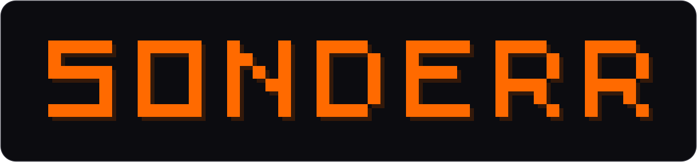

<div align="center">



**A BYOK AI coding agent — terminal-first, editor-integrated, desktop-wrapped.**

Bring your own key. Your providers, your models, your machine.

[](LICENSE)
[](https://www.typescript.org)
[](https://bun.sh)
[](https://github.com/dxn1-UBUNTU/sonderr/stargazers)
[](https://github.com/dxn1-UBUNTU/sonderr/pulls)

[Install](#install) · [Features](#features) · [Providers](#providers) · [Architecture](#architecture) · [Configuration](#configuration) · [Development](#development) · [License](#license)

</div>

---

## What is Sonderr

Sonderr is an agentic coding workspace that runs where you work: a terminal UI, a desktop app, and extensions for VS Code and JetBrains. It plans, reads and edits code, runs commands, and manages MCP servers — powered by API keys you own (BYOK), with no hosted middleman and no subscription.

Built on the MIT-licensed [Kilo Code](https://github.com/Kilo-Org/kilocode) codebase, which itself derives from [opencode](https://github.com/sst/opencode). Credit and thanks to both upstream projects.

## Features

- **BYOK providers** — OpenAI, Anthropic, Gemini, plus the Kilo Gateway free-model endpoint. Swap providers or models at runtime without restarting a session.
- **Background tasks** — Install dependencies, run builds, and execute tests in the background while you keep coding. Never wait when you can work.
- **Terminal UI** — A full TUI with sessions, plan mode, file/command tooling, and real-time streaming.
- **Desktop app** — Electron wrapper with an encrypted local config (`~/.config/sonderr/config.json`, AES-256-CBC, machine-derived key) and a built-in first-run setup screen.
- **Editor integrations** — VS Code extension with Agent Manager (multi-session orchestration, git worktree isolation), JetBrains plugin.
- **Enterprise MCP controls** — Dashboard-managed MCP server policy that can override local `mcp.json` files per organization.
- **Code quality first** — Verification checklists, self-review, and proactive background task execution built into the agent loop.
- **500+ AI models** — Via BYOK providers and the Kilo Gateway free-model endpoint.
- **Open source** — MIT licensed. No vendor lock-in, no subscription, no telemetry beyond what you opt into.

## Install

### Option 1: Global command (recommended)

Clone the repo and run the installer. This sets up `sonderr` as a global command that always runs the latest code:

```bash
git clone https://github.com/dxn1-UBUNTU/sonderr.git
cd sonderr
./scripts/install.sh
```

Then run from any directory:

```bash
sonderr
```

The global command self-bootstraps on every launch: it updates the checkout (`git pull`), installs Bun if missing, syncs dependencies, and opens the TUI in the directory you ran it from — always fresh, no manual rebuilds.

Make sure `~/.local/bin` is in your PATH. If not, add this to your shell profile:

```bash
export PATH="$HOME/.local/bin:$PATH"
```

### Option 2: Run directly with Bun

Requires [Bun](https://bun.sh) 1.3+.

```bash
git clone https://github.com/dxn1-UBUNTU/sonderr.git
cd sonderr
bun install
bun run dev          # runs the CLI in dev mode
```

### Option 3: Build a production binary

```bash
bun install
bun run --cwd packages/cli build
```

The built binary goes to `packages/cli/dist/@sonderr/cli/bin/sonderr`.

## Providers

| Provider | Models |
|---|---|
| OpenAI | GPT-4o, o-series, and newer |
| Anthropic | Claude Sonnet 4.6, Opus 4.1, and newer |
| Gemini | Gemini 2.5 Pro / Flash and newer |
| Kilo Gateway | Free/shortlist models via the Kilo Gateway API |

Configure in-session with `/api_attach` or directly in `sonderr.json`. Keys are stored locally, encrypted, and are only ever sent to the provider you configured.

## Architecture

Sonderr is a Bun + Turborepo monorepo with 35 packages:

| Package | Description |
|---|---|
| `@sonderr/cli` | Agent engine, CLI entry point, and HTTP server |
| `@sonderr/tui` | Terminal UI (SolidJS + OpenTUI) |
| `@sonderr/core` | Session, tool, and provider core |
| `@sonderr/server` | Local HTTP server |
| `@sonderr/protocol` | Client/server protocol definitions |
| `@sonderr/sdk` | Auto-generated JavaScript SDK |
| `@sonderr/gateway` | Kilo Gateway provider integration |
| `@sonderr-vscode` | VS Code extension with Agent Manager |
| `@sonderr-jetbrains` | JetBrains plugin |
| `sonderr-desktop` | Electron desktop app wrapper |
| `@sonderr-docs` | Documentation site |

## Configuration

| Scope | Path |
|---|---|
| CLI config | `~/.sonderr/` |
| Desktop config | `~/.config/sonderr/config.json` (AES-256-CBC encrypted, mode `0600`) |
| Project config | `.sonderr/` (commands, agents, plans, `sonderr.json`) |
| Global config | `~/.config/sonderr/` or `~/.sonderr/` |

MCP servers are configured per project (`mcp.json`) or globally, unless organization policy supplies a managed configuration.

## Development

```bash
bun install          # bootstrap all workspaces
bun run typecheck    # tsgo across packages
bun run lint         # oxlint
```

Unit tests live inside each package and run with `bun test` from that package's directory. Never run tests from the root.

## License

[MIT](LICENSE) — inherits and extends the licenses of Kilo Code and opencode. Upstream copyright notices are retained where applicable.