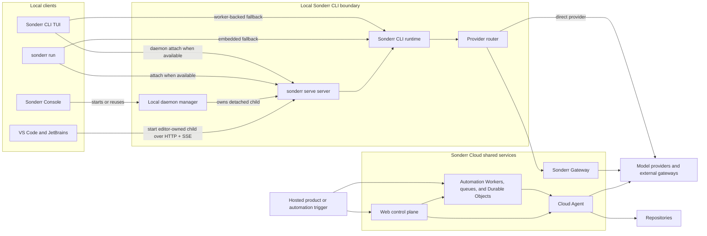
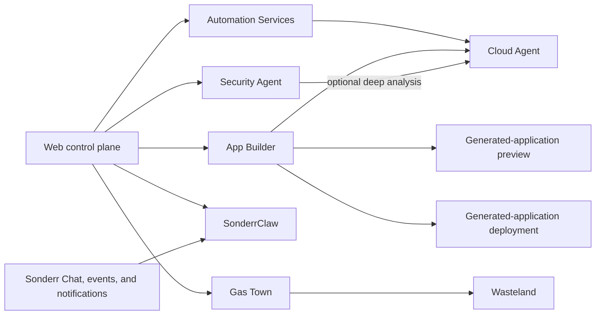

# Architecture Overview

This page maps Sonderr's repository-defined architecture. It introduces the local runtime, editor clients, cloud service boundaries, and hosted execution products before the subsystem pages add implementation detail.


Use these pages for stable system boundaries and contributor-wide contracts. Source code remains the reference for feature-level implementation details. Static source shows code paths and deployable surfaces, not production enablement, traffic, retention, or vendor configuration.


## How to read these pages

Choose the path closest to the change you are making:

| Contributor path | Suggested order |
|---|---|
| Local CLI or editor client | Architecture Overview -> [CLI Runtime](/docs/contributing/architecture/cli-runtime) -> [VS Code Extension](/docs/contributing/architecture/vscode-extension) or [JetBrains Plugin](/docs/contributing/architecture/jetbrains-plugin) |
| Hosted platform or automation | Architecture Overview -> [Cloud Platform](/docs/contributing/architecture/cloud-platform) -> [Automation Services](/docs/contributing/architecture/automation-services) |
| Security review | Architecture Overview -> [Cloud Platform](/docs/contributing/architecture/cloud-platform) -> [Cloud Security](/docs/contributing/architecture/cloud-security) |
| Architecture-facing implementation | Relevant architecture page -> [Development Patterns](/docs/contributing/architecture/development-patterns) |
| CLI config ownership or key change | [CLI Runtime](/docs/contributing/architecture/cli-runtime#config-precedence) -> [CLI Config Schema](/docs/contributing/architecture/config-schema) -> [Development Patterns](/docs/contributing/architecture/development-patterns) |

## Repository boundaries


References to Sonderr Console and `sonderr console` on the architecture pages describe a browser interface that is deprecated and will be removed in a future release.


Architecture pages cross two repositories:

| Repository | Contents |
|---|---|
| [Sonderr&#8209;Org/sonderr](https://github.com/Sonderr-Org/sonderr) | Sonderr CLI runtime, local daemon, Sonderr Console, VS Code extension, JetBrains plugin, JavaScript SDK, codebase indexing, Sonderr Gateway client, telemetry, docs, and shared UI packages |
| [Sonderr&#8209;Org/cloud](https://github.com/Sonderr-Org/cloud) | Web control plane, Sonderr Gateway routes, Cloud Agent session runtime, automation, generated-application preview and deployment services, SonderrClaw, Gas Town, billing, and supporting Workers |

## Three architecture layers

| Layer | Responsibility | Typical boundaries |
|---|---|---|
| Local runtime and clients | Runs local coding sessions and connects editor surfaces to one local agent engine | Sonderr CLI runtime, `sonderr serve` server, local daemon, Sonderr Console, VS Code extension, JetBrains plugin |
| Sonderr Cloud shared services | Handles hosted identity, authorization, model routing, billing, orchestration, and shared product services | Web control plane, Sonderr Gateway, Workers, queues, Durable Objects, persistence |
| Hosted product runtimes and automation | Runs scoped cloud work for coding, app generation, assistants, security analysis, and multi-agent orchestration | Cloud Agent, Automation Services, App Builder, Security Agent, SonderrClaw, Gas Town, Wasteland |

Local execution and hosted execution are separate boundaries. Editor clients use a local `sonderr serve` server. Hosted automation can launch Cloud Agent execution sessions when cloud coding work is required.

## Terms used throughout

| Term | Meaning |
|---|---|
| Sonderr | Umbrella product across local clients, Sonderr CLI runtime, and Sonderr Cloud services |
| Sonderr CLI runtime | Local agent engine in `packages/cli/`; owns tools, sessions, config, persistence, and provider routing |
| `sonderr serve` server | Local HTTP and SSE process used by editor clients and Sonderr Console; selected browser-oriented paths also use WebSocket |
| Local daemon | Detached reusable `sonderr serve` server managed by `sonderr daemon` commands |
| Directory context | Normalized local filesystem directory used to select local runtime state |
| Local runtime instance | Directory-keyed runtime context inside one Sonderr CLI process |
| Local routing workspace | Optional routing context that can resolve to a local directory or remote target |
| Worktree directory | Alternate git worktree path used as a directory context for isolated concurrent work |
| Web control plane | Hosted Sonderr Cloud application layer for identity, organization authorization, billing, product configuration, and API orchestration |
| Sonderr Gateway | First-party hosted model-routing boundary |
| Cloud Agent | Hosted coding-session capability. A Cloud Agent execution session is one hosted run; current session runtime implementation lives in `services/cloud-agent-next/`. |

## Core execution spine

The three layers appear in two primary execution shapes: local client requests and hosted cloud work.

### Two execution paths

| Path | Starts from | Runs in | What to remember |
|---|---|---|---|
| Local coding | Sonderr CLI, Sonderr Console, VS Code, or JetBrains | Sonderr CLI runtime on developer machine | Editor clients talk to local `sonderr serve` server. Local runtime owns coding session and sends model requests directly or through Sonderr Gateway. |
| Hosted work | Webhook, source-control event, command, schedule, or hosted product | Sonderr Cloud services; Cloud Agent when coding is required | Cloud services coordinate work. Only flows that need repository changes launch Cloud Agent execution session. |

This distinction is central: using editor does not move coding session into Cloud Agent. Cloud services also route model requests, deliver chat events, dispatch notifications, serve generated applications, and coordinate adjacent hosted boundaries without launching Cloud Agent.

## Adjacent hosted boundaries

The core execution spine is not the full cloud product catalog. These service families and hosted runtimes attach to it for specific product flows:

| Boundary | Role | Topology or workflow | Security review |
|---|---|---|---|
| Automation Services | Turns commands, source-control events, labels, webhooks, and schedules into scoped work | [Automation Services](/docs/contributing/architecture/automation-services) | [Trust boundaries](/docs/contributing/architecture/cloud-security#trust-boundaries) |
| App Builder | Coordinates generated-application coding, preview, build, and deployment boundaries | [Cloud Platform](/docs/contributing/architecture/cloud-platform#app-generation-boundaries) | [Preview and deployment](/docs/contributing/architecture/cloud-security#generated-application-preview-and-deployment) |
| Security Agent | Syncs findings and analyzes risk; selected deep analysis can launch Cloud Agent | [Cloud Platform](/docs/contributing/architecture/cloud-platform#security-agent) | [Sync and cleanup](/docs/contributing/architecture/cloud-security#security-agent-sync-and-cleanup) |
| SonderrClaw | Coordinates owner-scoped hosted assistant runtimes | [Cloud Platform](/docs/contributing/architecture/cloud-platform#sonderrclaw) | [SonderrClaw ingress](/docs/contributing/architecture/cloud-security#sonderrclaw-ingress) |
| Gas Town and Wasteland | Coordinate multi-agent repository work and collaborative commons paths | [Cloud Platform](/docs/contributing/architecture/cloud-platform#gas-town-and-wasteland) | [Trust boundaries](/docs/contributing/architecture/cloud-security#trust-boundaries) |

## Local entry points and clients

These local surfaces live in [`Sonderr-Org/sonderr`](https://github.com/Sonderr-Org/sonderr). Package paths below are relative to that repository root.

| Surface | Package in `Sonderr-Org/sonderr` | Runtime model |
|---|---|---|
| Sonderr CLI TUI | `packages/cli/` | Interactive local client with daemon attach and worker-backed fallback paths |
| `sonderr run` | `packages/cli/` | Headless prompt execution through explicit attach, daemon attach, or embedded fallback |
| `sonderr serve` | `packages/cli/` | Local HTTP + SSE server for local clients |
| Sonderr Console (deprecated) | `packages/sonderr-console/``packages/cli/` | Deprecated browser UI served at `/console` by a started or reused local daemon |
| VS Code extension | `packages/sonderr-vscode/` | Extension host starts one shared editor-owned `sonderr serve` server and routes webviews through HTTP + global SSE; SDK directory selects local runtime instance |
| JetBrains plugin | `packages/sonderr-jetbrains/` | Split-mode Swing plugin; backend module starts one editor-owned `sonderr serve` server and caches workspace clients by directory |

## Cloud service families

Hosted service families live in [`Sonderr-Org/cloud`](https://github.com/Sonderr-Org/cloud). Paths below are relative to that repository root unless another repository is named.

| Boundary | Primary source paths | Role |
|---|---|---|
| Sonderr Cloud | `apps/web/``services/` | Hosted platform repository for identity, billing, routing, product configuration, automation, and scoped execution services |
| Web control plane | `apps/web/` | Hosted application layer for authorization, configuration, and API orchestration |
| Sonderr Gateway | `apps/web/src/app/api/gateway/``apps/web/src/lib/ai-gateway/`Local integration: `Sonderr-Org/sonderr/packages/sonderr-gateway/` | First-party model-routing boundary and local client integration |
| Cloud Agent | `services/cloud-agent-next/` | Hosted coding-session capability with policy-selected sandbox allocation |
| Automation Services | `services/code-review-infra/``services/auto-triage-infra/``services/auto-fix-infra/``services/security-auto-analysis/``services/security-sync/``services/webhook-agent-ingest/` | Trigger-driven review, triage, fix, security, and configured webhook flows |
| Adjacent hosted boundaries | `services/app-builder/``services/sonderrclaw/``services/gastown/``services/wasteland/`Supporting services | App Builder, SonderrClaw, Gas Town, Wasteland, chat, notifications, and supporting services |

## Supporting packages

These supporting packages also live in [`Sonderr-Org/sonderr`](https://github.com/Sonderr-Org/sonderr). Package paths below are relative to that repository root.

| Package in `Sonderr-Org/sonderr` | Role |
|---|---|
| `packages/sonderr-indexing/` | Per-directory asynchronous codebase indexing engine behind Sonderr CLI bridge |
| `packages/sdk/js/` | Generated JavaScript client and handwritten wrapper for local server APIs |
| `packages/sonderr-gateway/` | Local Sonderr Gateway client integration used by Sonderr CLI runtime |
| `packages/sonderr-console/` | Deprecated browser UI served by local daemon at `/console` |

## Architecture pages

| Page | What it covers |
|---|---|
| [CLI Runtime](/docs/contributing/architecture/cli-runtime) | Local execution modes, daemon, server authentication, routing, persistence, snapshots, SDK, config, SSE, Sonderr Console, and indexing |
| [VS Code Extension](/docs/contributing/architecture/vscode-extension) | Shared local `sonderr serve` ownership, webview bridge, Agent Manager, PTYs, recovery, bundled resources, and build outputs |
| [JetBrains Plugin](/docs/contributing/architecture/jetbrains-plugin) | Split-mode modules, RPC, bundled local `sonderr serve` lifecycle, Kotlin SDK, recovery, and remote-development constraints |
| [Cloud Platform](/docs/contributing/architecture/cloud-platform) | Hosted service inventory, Cloud Agent topology, shared cloud boundaries, and adjacent hosted runtimes |
| [Automation Services](/docs/contributing/architecture/automation-services) | Trigger-driven Workers, queues, callbacks, ownership, and scoped execution paths |
| [Cloud Security](/docs/contributing/architecture/cloud-security) | Cloud trust boundaries, data flows, persistence, isolation, controls, and third-party categories |

## Development pages

After system-boundary pages, continue with Development Patterns for implementation rules. Use CLI Config Schema when changing config keys or editor-facing schema publication.

| Page | What it covers |
|---|---|
| [Development Patterns](/docs/contributing/architecture/development-patterns) | Code-ownership decisions, shared-file seams, SDK generation, validation guards, and fork maintenance |
| [CLI Config Schema](/docs/contributing/architecture/config-schema) | Separate runtime-loading and editor-validation paths for cross-repository config contract |

## Related pages

- [CLI Runtime](/docs/contributing/architecture/cli-runtime) - local runtime, server, routing, persistence, and SDK contracts
- [Cloud Platform](/docs/contributing/architecture/cloud-platform) - hosted layers, Cloud Agent topology, and adjacent hosted boundaries
- [Cloud Security](/docs/contributing/architecture/cloud-security) - cross-cutting trust boundaries, controls, and shared responsibility
- [Development Patterns](/docs/contributing/architecture/development-patterns) - code-ownership decisions and contributor workflow
- [Development Environment](/docs/contributing/development-environment) - setup guide
- [Ecosystem](/docs/contributing/ecosystem) - related projects and integrations
